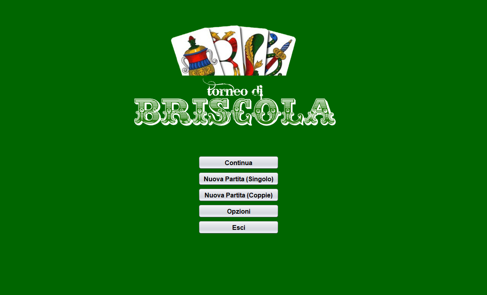
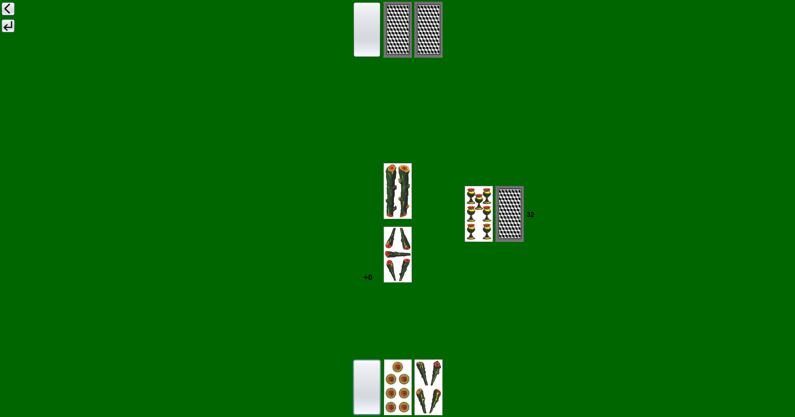
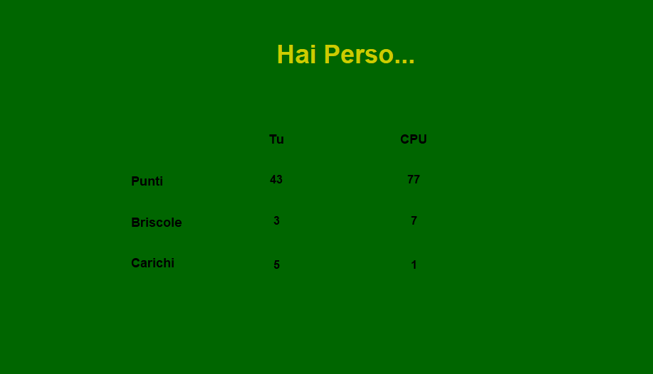
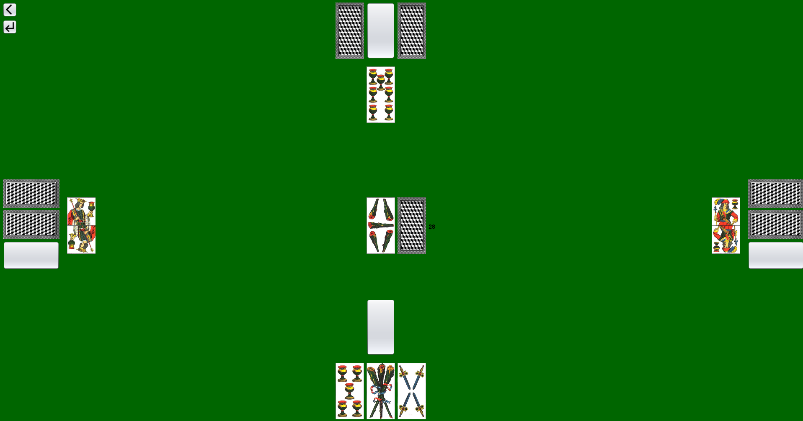
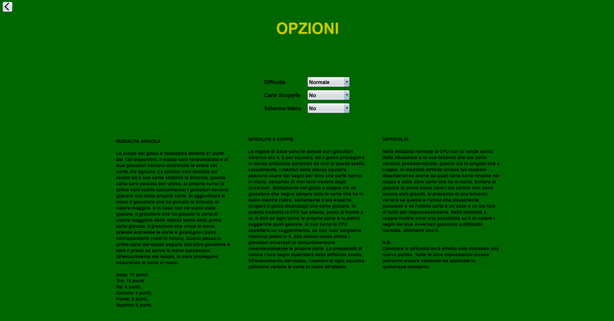

# Briscola App
This Java Swing application lets you play the classic Italian card game Briscola. Challenge a CPU opponent in single-player mode, or team up with an AI partner against another CPU duo. Count points, declare winners, and fine-tune your strategy!

## Features
* **Single-Player Mode**: Go head-to-head against a CPU.
* **Team Play**: Play with a CPU partner against two other CPU opponents.
* **Score Tracking**: The app keeps score and announces the game winner.
* **Multiple Matches**: Play game after game without restarting.
* **Undo Last Move**: Easily correct misplays.
* **Revealed Cards Mode**: See all cards on the table to study and understand the CPU's logic.
* **Adjustable Difficulty**:
    * **Easy**: Basic CPU play.
    * **Hard**: CPU tracks played cards for more strategic decisions.
* **Optimal CPU Strategy**: The AI always aims for the best possible move to win tricks and the game.
* **Swing GUI**: A fully graphical user interface built with Java Swing.

## Screenshot

